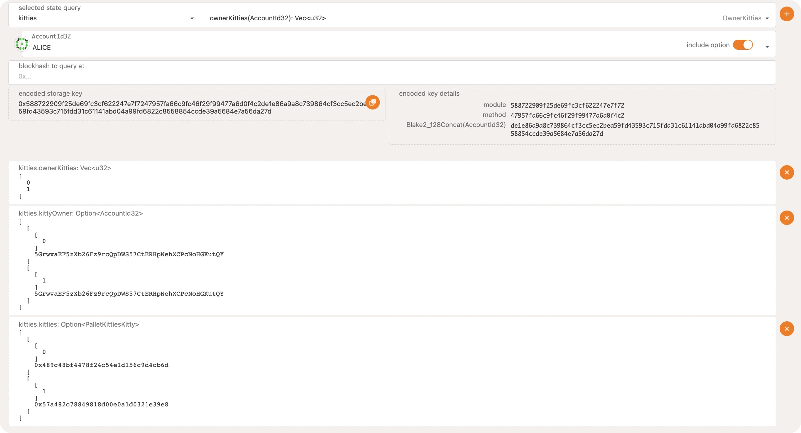
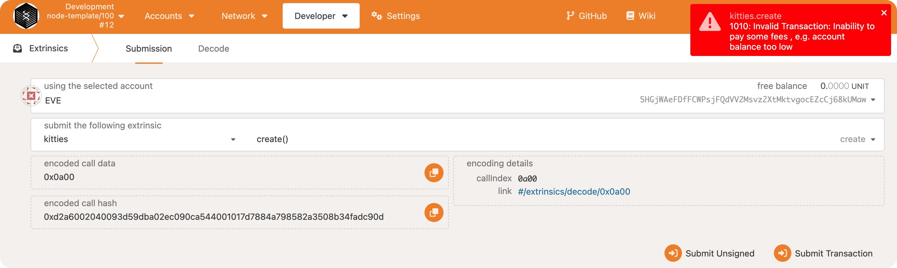
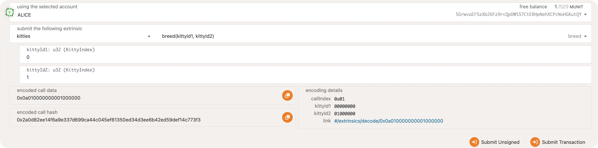
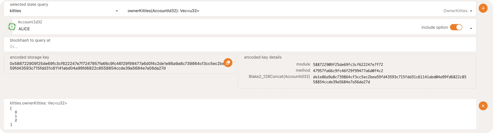
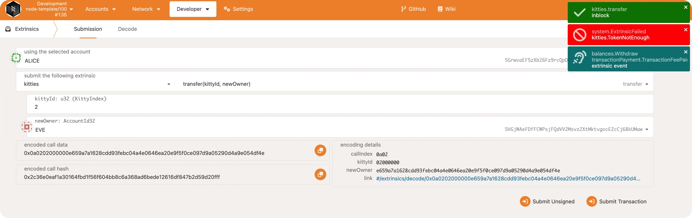

# 1. 为 Alice 创建两只 Kitty 后，查询一些结果

第一项是 Alice 拥有的所有 Kitty 的 Index

第二项是 每个 KittyIndex 对应的拥有者

第三项是 每个 Index 对应的具体的 Kitty
# 2. Create Kitty 时 Token 不足，无法质押

# 3. Alice 的两只 Kitty 生小猫

查询 Alice 名下多了只小猫

# 4. 想把小猫送给 Eve，但 Even 没有足够的 Token 质押
