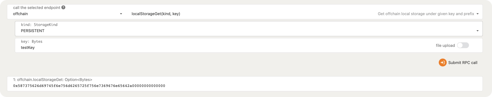

**1.在 Offchain Worker 中，使用 Offchain Indexing 特性实现从链上向 Offchain Storage 中写入数据.** 

同Q2

**2.使用 js sdk 从浏览器 frontend 获取到前面写入 Offchain Storage 的数据**

**3.回答链上随机数（如前面Kitties示例中）与链下随机数的区别**

链上随机数：Randomness Collective Flip 模块提供了一个 `random` 函数，该函数根据到此之前的81个块的哈希值来生成随机数。

链下随机数：这是根据主机环境生成的不确定的真随机数。

**4.（可选）在 Offchain Worker 中，解决向链上发起不签名请求时剩下的那个错误。**

参考链接：https://github.com/paritytech/substrate/blob/master/frame/examples/offchain-worker/src/lib.rs

**5.（可选）构思一个应用场景，描述如何使用 Offchain Features 三大组件去实现它**

链下数学模型计算

step1 将需要输入数学模型的数据写入indexing 

step2 通过offchain worker 读取输入数据，调用本地数学模型进行数值计算 

step3 通过signed transaction将计算出来的数值结果传回链上

**6.（可选）如果有时间，可以实现一个上述原型**